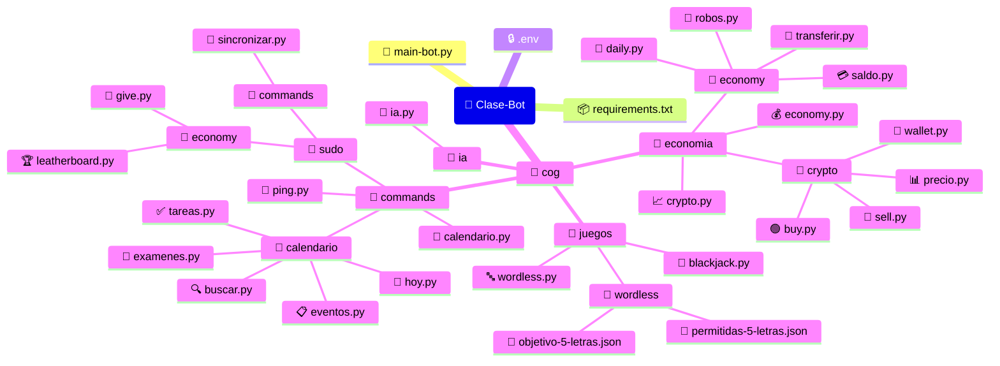
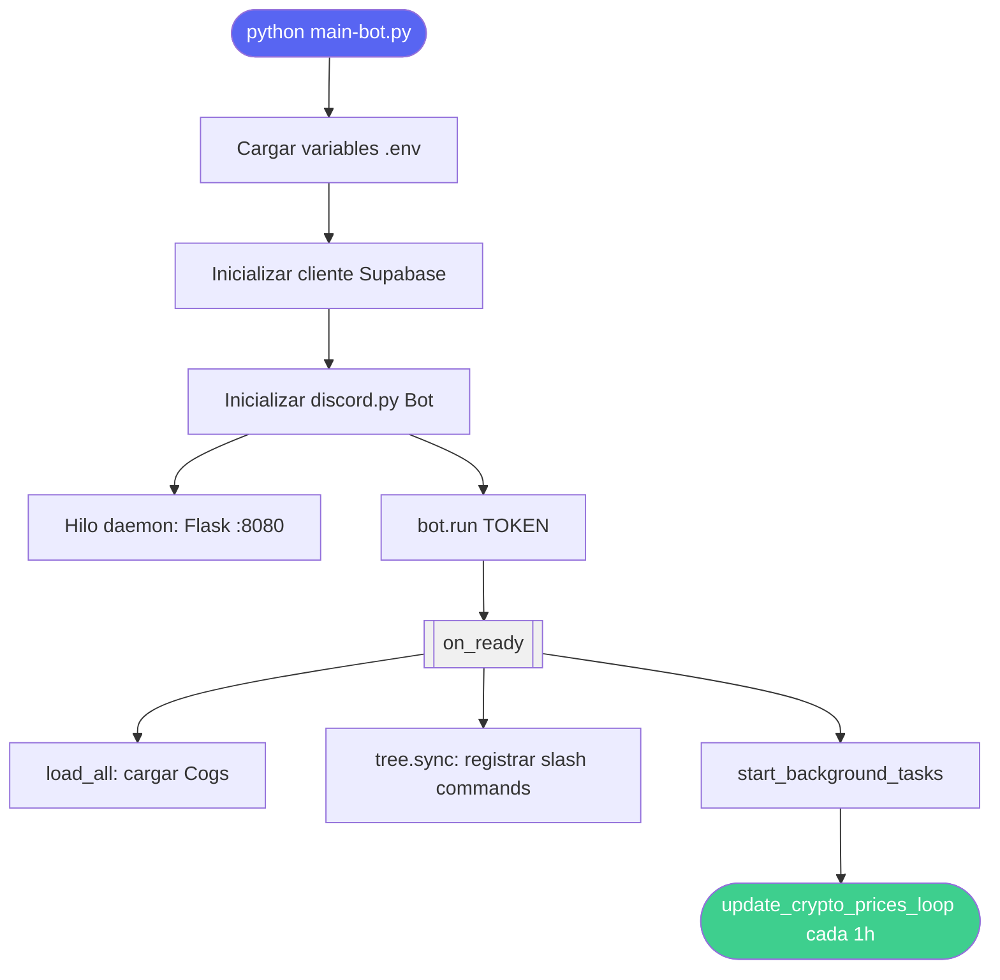
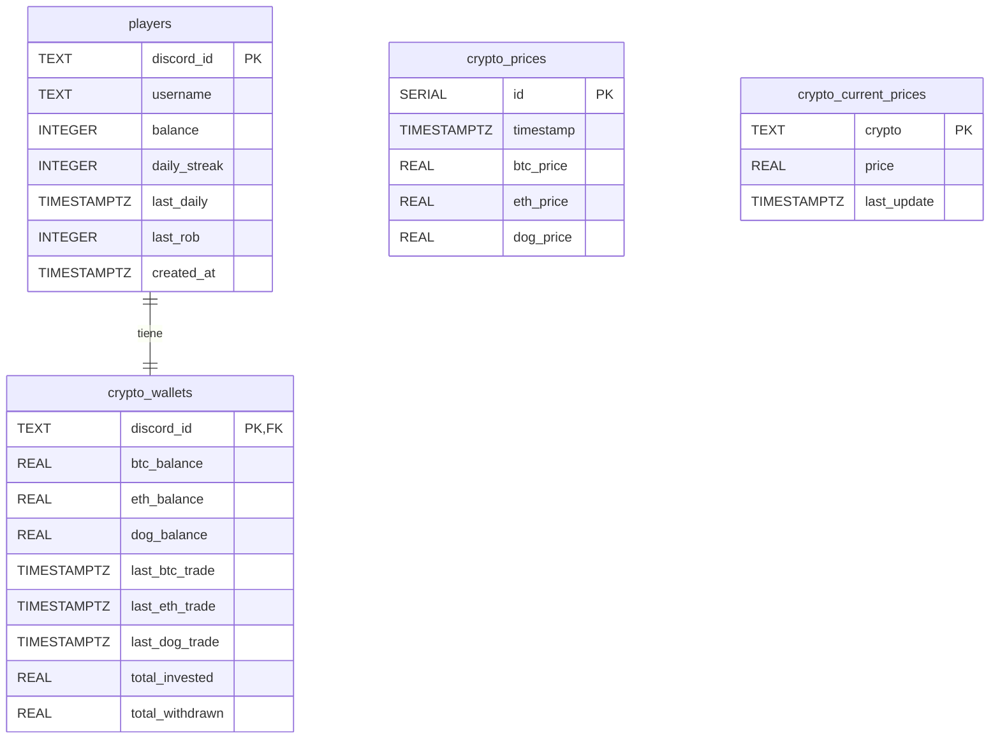

# 🤖 Clase Bot — Discord Bot Multifunción

> Bot de Discord modular para gestión académica, economía virtual, trading de criptomonedas e inteligencia artificial, desarrollado con `discord.py` y `Supabase`.

[](https://www.python.org/)
[](https://discordpy.readthedocs.io/)
[](https://supabase.com/)
[](LICENSE)

---

## 📋 Índice

- [✨ Características](#-características)
- [🏗️ Arquitectura del Proyecto](#️-arquitectura-del-proyecto)
- [🚀 Instalación](#-instalación)
- [⚙️ Configuración](#️-configuración)
- [🗄️ Configuración de la Base de Datos](#️-configuración-de-la-base-de-datos)
- [📡 API Web Integrada](#-api-web-integrada)
- [📖 Manual de Usuario](#-manual-de-usuario)
- [🔧 Guía de Mantenibilidad](#-guía-de-mantenibilidad)
- [📝 CHANGELOG](#-changelog)

---

## ✨ Características

| Módulo | Descripción | Estado |
|--------|-------------|--------|
| 📅 **Calendario** | Sincronización con Google Calendar y Moodle vía iCal | ✅ Activo |
| 💰 **Economía** | Saldo, transferencias, robos y recompensas diarias | ✅ Activo |
| 📈 **Criptomonedas** | Trading simulado de BTC, ETH y DOGE con precios históricos | ✅ Activo |
| 🤖 **Asistente IA** | Integración con modelos LLM a través de OpenRouter | ✅ Activo |
| 🎮 **Juegos** | Blackjack multijugador y Wordless (Wordle en español) | ✅ Activo |
| 🏆 **Leaderboard** | Clasificación global actualizada en tiempo real | ✅ Activo |
| 🌐 **Panel Web** | Dashboard de estado accesible en el puerto 8080 | ✅ Activo |

---

## 🏗️ Arquitectura del Proyecto

El bot sigue el patrón **Cog** de `discord.py`, que equivale a un patrón de **módulos desacoplados**: cada funcionalidad reside en su propio `Cog` (extensión), lo que permite cargar, recargar o deshabilitar módulos sin reiniciar el proceso principal.



### Diagrama de flujo de arranque



---

## 🚀 Instalación

### Requisitos previos

| Herramienta | Versión mínima | Enlace |
|-------------|----------------|--------|
| Python | 3.10 | [python.org](https://www.python.org/downloads/) |
| pip | Incluido con Python | — |
| Cuenta Discord Developer | — | [discord.com/developers](https://discord.com/developers/applications) |
| Proyecto Supabase | — | [supabase.com](https://supabase.com) |
| API Key OpenRouter | — | [openrouter.ai](https://openrouter.ai) |

### Paso 1 — Clonar el repositorio

```bash
git clone https://github.com/tuusuario/clase-bot.git
cd clase-bot
```

### Paso 2 — Crear y activar el entorno virtual

```bash
# Crear entorno virtual
python -m venv venv

# Activar en Linux / macOS
source venv/bin/activate

# Activar en Windows (PowerShell)
.\venv\Scripts\Activate.ps1
```

### Paso 3 — Instalar dependencias

```bash
pip install -r requirements.txt
```

### Paso 4 — Configurar las variables de entorno

Copia la plantilla y rellena tus credenciales (ver sección [Configuración](#️-configuración)):

```bash
cp .env.example .env
# Edita .env con tu editor favorito
```

### Paso 5 — Configurar la base de datos

Ejecuta los scripts SQL de la sección [Configuración de la Base de Datos](#️-configuración-de-la-base-de-datos) en el editor SQL de tu proyecto Supabase.

### Paso 6 — Ejecutar el bot

```bash
python main-bot.py
```

Si el arranque es correcto verás en consola:

```
🌐 Iniciando servidor web en puerto 8080...
🤖 Bot conectado como ClaseBot#1234
✅ Cog cargado: blackjack.py
✅ Cog cargado: wordless.py
...
📜 12 comandos cargados
✅ Tareas en segundo plano iniciadas
```

---

## ⚙️ Configuración

### Archivo `.env`

Crea un fichero `.env` en la raíz del proyecto con el siguiente contenido:

```env
# ── Discord ────────────────────────────────────────────────
DISCORD_TOKEN=tu_token_de_bot_aqui

# IDs de canales (formato: número entero)
CHANNEL_LEADERBOARD_ID=123456789012345678
CHANNEL_TROPHY_ID=123456789012345679
CHANNEL_BET_ID=123456789012345680

# ── Inteligencia Artificial ────────────────────────────────
OPENROUTER_API_KEY=sk-or-v1-...

# ── Calendarios (URLs públicas iCal) ──────────────────────
MOODLE_CALENDAR_URL=https://tu-moodle.com/calendar/export_execute.php?...
GOOGLE_CALENDAR_URL=https://calendar.google.com/calendar/ical/...%40group.calendar.google.com/public/basic.ics

# ── Base de Datos (Supabase) ───────────────────────────────
SUPABASE_URL=https://xxxxxxxxxxx.supabase.co
SUPABASE_KEY=eyJhbGciOiJIUzI1NiIsInR5cCI6IkpXVCJ9...
```

> ⚠️ **Nunca subas `.env` a Git.** El fichero ya está incluido en `.gitignore`.

### Configuración del Bot en Discord Developer Portal

1. Accede a [discord.com/developers/applications](https://discord.com/developers/applications) y selecciona tu aplicación.
2. En la pestaña **Bot**, activa los tres **Privileged Gateway Intents**:
   - ✅ Presence Intent
   - ✅ Server Members Intent
   - ✅ Message Content Intent
3. En la pestaña **OAuth2 → URL Generator**, selecciona los scopes `bot` y `applications.commands`, y los permisos:
   - ✅ Read Messages / View Channels
   - ✅ Send Messages
   - ✅ Embed Links
   - ✅ Use Slash Commands
   - ✅ Manage Messages *(necesario para el leaderboard)*
4. Usa la URL generada para invitar el bot a tu servidor.

---

## 🗄️ Configuración de la Base de Datos

Ejecuta este script completo en el **SQL Editor** de tu proyecto Supabase.

### Diagrama Entidad-Relación



### Script SQL de creación

```sql
-- ── Tabla principal de jugadores ──────────────────────────
CREATE TABLE players (
    discord_id    TEXT PRIMARY KEY,
    username      TEXT                      NOT NULL,
    balance       INTEGER                   DEFAULT 500,
    daily_streak  INTEGER                   DEFAULT 0,
    last_daily    TIMESTAMP WITH TIME ZONE,
    last_rob      INTEGER                   DEFAULT 0,
    created_at    TIMESTAMP WITH TIME ZONE  DEFAULT NOW()
);

-- ── Wallets de criptomonedas ──────────────────────────────
CREATE TABLE crypto_wallets (
    discord_id       TEXT PRIMARY KEY REFERENCES players(discord_id),
    btc_balance      REAL    DEFAULT 0,
    eth_balance      REAL    DEFAULT 0,
    dog_balance      REAL    DEFAULT 0,
    last_btc_trade   TIMESTAMP WITH TIME ZONE,
    last_eth_trade   TIMESTAMP WITH TIME ZONE,
    last_dog_trade   TIMESTAMP WITH TIME ZONE,
    total_invested   REAL    DEFAULT 0,
    total_withdrawn  REAL    DEFAULT 0
);

-- ── Historial de precios (serie temporal) ─────────────────
CREATE TABLE crypto_prices (
    id         SERIAL PRIMARY KEY,
    timestamp  TIMESTAMP WITH TIME ZONE  DEFAULT NOW(),
    btc_price  REAL,
    eth_price  REAL,
    dog_price  REAL
);

-- ── Precio actual por moneda ──────────────────────────────
CREATE TABLE crypto_current_prices (
    crypto       TEXT PRIMARY KEY,
    price        REAL,
    last_update  TIMESTAMP WITH TIME ZONE
);

-- ── Datos iniciales ───────────────────────────────────────
INSERT INTO crypto_current_prices (crypto, price, last_update) VALUES
    ('BTC', 10000, NOW()),
    ('ETH', 3000,  NOW()),
    ('DOG', 50,    NOW())
ON CONFLICT (crypto) DO NOTHING;

INSERT INTO crypto_prices (btc_price, eth_price, dog_price)
VALUES (10000, 3000, 50);
```

### Políticas de seguridad (Row Level Security)

```sql
-- Habilitar RLS en todas las tablas
ALTER TABLE players               ENABLE ROW LEVEL SECURITY;
ALTER TABLE crypto_wallets        ENABLE ROW LEVEL SECURITY;
ALTER TABLE crypto_prices         ENABLE ROW LEVEL SECURITY;
ALTER TABLE crypto_current_prices ENABLE ROW LEVEL SECURITY;

-- Acceso total para el service role del bot
CREATE POLICY "Bot full access – players"
    ON players FOR ALL USING (true);

CREATE POLICY "Bot full access – crypto_wallets"
    ON crypto_wallets FOR ALL USING (true);

CREATE POLICY "Public read – crypto_prices"
    ON crypto_prices FOR SELECT USING (true);

CREATE POLICY "Public read – crypto_current_prices"
    ON crypto_current_prices FOR SELECT USING (true);
```

---

## 📡 API Web Integrada

El bot expone un pequeño servidor **Flask** (puerto `8080`) útil para plataformas de hosting como Render o Railway, que requieren un endpoint HTTP para verificar que el proceso sigue vivo.

### `GET /`

Devuelve el panel HTML de estado del bot.

**Respuesta:** `text/html` con los contadores de servidores, usuarios y uptime.

---

### `GET /health`

Endpoint de health-check para balanceadores de carga y monitores externos.

**Respuesta `200 OK`:**

```json
{
  "status": "online",
  "timestamp": "2025-12-11T14:07:00.000000",
  "service": "discord_bot",
  "version": "1.0.0"
}
```

| Campo | Tipo | Descripción |
|-------|------|-------------|
| `status` | `string` | `"online"` \| `"iniciando"` \| `"error"` |
| `timestamp` | `string` | Fecha y hora ISO 8601 de la consulta |
| `service` | `string` | Identificador del servicio |
| `version` | `string` | Versión del bot |

---

### `GET /api/stats`

Devuelve estadísticas en tiempo real del bot en formato JSON.

**Respuesta `200 OK`:**

```json
{
  "status": "online",
  "start_time": "2025-12-11 14:07:00",
  "guild_count": 3,
  "user_count": 142,
  "command_count": 12
}
```

| Campo | Tipo | Descripción |
|-------|------|-------------|
| `status` | `string` | Estado actual del proceso |
| `start_time` | `string` | Marca temporal de inicio (`YYYY-MM-DD HH:MM:SS`) |
| `guild_count` | `integer` | Número de servidores en los que está el bot |
| `user_count` | `integer` | Total de miembros en todos los servidores |
| `command_count` | `integer` | Slash commands registrados en Discord |

> **Nota:** Si el endpoint devuelve `{"status": "iniciando"}`, el bot aún está en proceso de arranque. Reintentar en unos segundos.

---

## 📖 Manual de Usuario

### Comandos generales

#### `/ping`

Comprueba la latencia entre Discord y el bot.

```
/ping
→ 🏓 Pong! Latencia: 48ms
```

---

### Calendario académico

Todos los comandos del calendario se agrupan bajo `/calendario`.

| Comando | Descripción |
|---------|-------------|
| `/calendario hoy` | Muestra los exámenes y tareas programadas para el día de hoy |
| `/calendario eventos` | Lista todos los eventos futuros sincronizados |
| `/calendario examenes` | Próximos exámenes desde Google Calendar |
| `/calendario tareas` | Plazos de entrega próximos desde Moodle |
| `/calendario buscar <término>` | Busca un evento por nombre en ambas fuentes |

**Ejemplo:**

```
/calendario buscar matematicas
→ 📅 Resultados para "matematicas":
   • Examen Matemáticas II — 15 dic, 10:00h (Google Calendar)
   • Entrega Práctica 3 — 18 dic, 23:59h (Moodle)
```

---

### Economía virtual

#### Consultar saldo

```
/economy saldo              → Tu propio saldo
/economy saldo @usuario     → Saldo de otro usuario
```

#### Transferir monedas

```
/economy transferir @amigo 500
→ ✅ Has enviado 500 monedas a @amigo
```

> La transferencia falla si no tienes saldo suficiente o si el destinatario no existe.

#### Recompensa diaria

```
/economy diario
→ 🎁 Has reclamado tu recompensa: +200 monedas (racha: 3 días)
```

La recompensa aumenta con la racha de días consecutivos. Reinicia si saltas un día.

#### Robar a otro usuario

```
/economy robar @usuario
→ ✅ ¡Éxito! Has robado 120 monedas a @usuario.
→ ❌ ¡Te han pillado! Multa de 100 monedas.
```

> El resultado es probabilístico. Existe un cooldown entre robos.

---

### Criptomonedas virtuales

Las monedas disponibles son `BTC`, `ETH` y `DOG`. Los precios fluctúan cada hora.

```
/crypto precio BTC           → 📈 Precio actual de BTC: 10,432 monedas
/crypto comprar BTC 2        → ✅ Has comprado 2 BTC por 20,864 monedas
/crypto vender ETH 1         → ✅ Has vendido 1 ETH por 3,150 monedas
/crypto wallet               → 💼 Tu cartera: 2 BTC · 0 ETH · 50 DOG
```

---

### Asistente de IA

```
/ia ¿Qué es el teorema de Pitágoras?
/ia Explícame la fotosíntesis modelo:gpt-4o
```

El modelo por defecto es `tngtech/deepseek-r1t-chimera:free`. Puedes especificar cualquier modelo disponible en [openrouter.ai/models](https://openrouter.ai/models).

---

### Juegos

#### Blackjack

```
# 1. Un jugador crea la partida con apuesta mínima
/blackjack crear 50

# 2. Otros jugadores se unen
/blackjack unirse 100

# 3. La partida comienza automáticamente
# Los ganadores reciben su apuesta x2
```

#### Wordless (Wordle en español)

```
# 1. Iniciar partida
/wordless crear
→ 🔤 ¡Nueva partida! Adivina la palabra de 5 letras.

# 2. Introducir intentos
/wordless intento gatos
→ 🟩🟨⬛⬛🟩
   G=✅ A=🔶 T=❌ O=❌ S=✅
```

Leyenda de colores: 🟩 letra en posición correcta · 🟨 letra en la palabra pero en otra posición · ⬛ letra no está en la palabra.

---

### Comandos de administración (`/sudo`)

> Estos comandos requieren permisos de administrador en el servidor.

| Comando | Descripción |
|---------|-------------|
| `/sudo sincronizar` | Fuerza la sincronización del calendario con Google y Moodle |
| `/sudo give @usuario <cantidad>` | Otorga monedas a un usuario |
| `/sudo leaderboard` | Actualiza el embed del leaderboard en el canal configurado |

---

## 🔧 Guía de Mantenibilidad

### Añadir un nuevo comando de economía

1. Crea un fichero en `cog/economia/economy/mi_comando.py`.
2. Implementa la función `setup_command(group, cog)`:

```python
from discord import app_commands
import discord

def setup_command(group: app_commands.Group, cog):
    @group.command(name="mi-comando", description="Descripción del comando")
    async def mi_comando(interaction: discord.Interaction):
        # Acceder a Supabase a través del bot
        supabase = cog.bot.supabase
        player = cog.bot.get_player(str(interaction.user.id), interaction.user.name)
        await interaction.response.send_message("¡Funciona!")
```

3. El sistema de carga automática detectará el nuevo fichero en el arranque. No es necesario modificar `economy.py`.

### Añadir un nuevo Cog independiente

1. Crea el fichero en la carpeta de cog correspondiente (p. ej. `cog/juegos/mi_juego.py`).
2. Implementa la función `setup(bot)` al final del fichero:

```python
async def setup(bot):
    await bot.add_cog(MiJuegoCog(bot))
```

3. El bot lo cargará automáticamente en el siguiente arranque.

### Dependencias

Para añadir una nueva dependencia:

```bash
pip install nueva-libreria
pip freeze | grep nueva-libreria >> requirements.txt
```

Fija siempre la versión mínima en `requirements.txt` para garantizar reproducibilidad.

### Variables de entorno

Cualquier nueva variable de entorno debe:
1. Añadirse al fichero `.env` local.
2. Documentarse en este README dentro de la sección [Configuración](#️-configuración).
3. Declararse en `.env.example` con un valor de placeholder (sin datos reales).

### Ejecutar en producción (Render / Railway)

El bot incluye un servidor Flask que responde en el puerto `8080`. Configura el health-check de tu plataforma apuntando a `GET /health`. Asegúrate de definir todas las variables de entorno del fichero `.env` en el panel de configuración de tu proveedor de hosting.

---

## 📝 CHANGELOG

### v5.1.0 — 2025-12-11
- **Añadido:** Módulo completo de criptomonedas (`/crypto`) con BTC, ETH y DOGE.
- **Añadido:** Panel web Flask en el puerto 8080 con endpoints `/health` y `/api/stats`.
- **Añadido:** Tarea en segundo plano para actualizar precios cada hora.
- **Mejorado:** `get_player()` crea automáticamente la wallet de criptomonedas al registrar un nuevo usuario.

### v5.0.0 — 2025-12-03
- **Añadido:** Sistema de economía virtual completo (saldo, transferir, robar, diario).
- **Añadido:** Integración con OpenRouter para el asistente de IA (`/ia`).
- **Añadido:** Juego Wordless en español con diccionario de 5 letras.
- **Añadido:** Blackjack multijugador con apuestas.
- **Añadido:** Sistema de calendario con sincronización Google Calendar y Moodle.
- **Arquitectura:** Migración completa a arquitectura Cog modular.
- **Base de datos:** Migración a Supabase (PostgreSQL en la nube).

### v4.x — Versiones anteriores
- Comandos de prefijo (`!comando`) sin slash commands.
- Base de datos local SQLite.

---

## 🛠️ Tecnologías

| Librería | Versión | Propósito |
|----------|---------|-----------|
| `discord.py` | ≥ 2.3.0 | Interacción con la API de Discord |
| `supabase` | latest | Cliente Python para Supabase / PostgreSQL |
| `python-dotenv` | ≥ 1.0.0 | Carga de variables de entorno desde `.env` |
| `requests` | ≥ 2.31.0 | Llamadas HTTP síncronas (OpenRouter, calendarios) |
| `aiohttp` | latest | Llamadas HTTP asíncronas |
| `icalendar` | ≥ 5.0.0 | Parseo de ficheros iCal (.ics) |
| `pytz` | ≥ 2023.3 | Gestión de zonas horarias |
| `Flask` | latest | Servidor web de estado integrado |
| `postgrest` | latest | Dependencia interna de `supabase-py` |

---

## 🤝 Contribuir

1. Haz un **fork** del repositorio.
2. Crea una rama con un nombre descriptivo:
   ```bash
   git checkout -b feat/nombre-de-la-funcionalidad
   ```
3. Realiza tus cambios siguiendo el patrón de Cog existente.
4. Haz commit con un mensaje claro:
   ```bash
   git commit -m "feat(economia): añadir comando /economy invertir"
   ```
5. Abre un **Pull Request** describiendo el propósito del cambio y cualquier decisión de diseño relevante.

---

*Última actualización: 1 de abril de 2026 · Versión 5.1.0*
